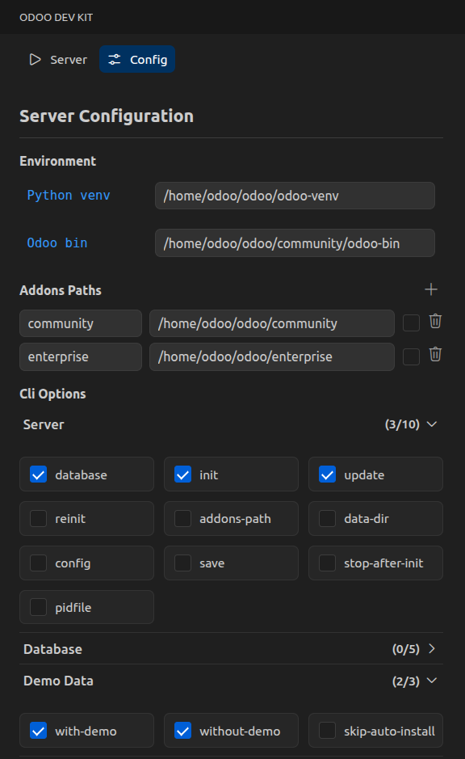
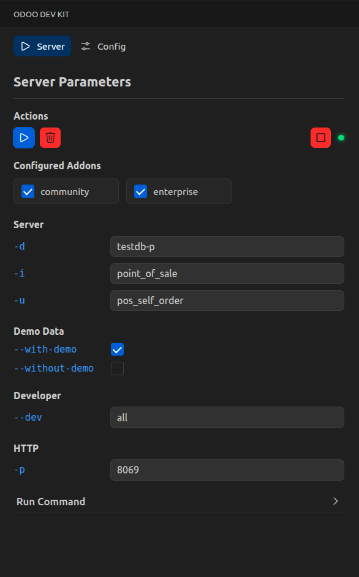

# Odoo Dev Kit

VS Code sidebar to configure and run Odoo quickly with a generated command, server controls, and helpful presets.

## Features

- Configure Odoo addons, CLI options, and environment paths.
- Generate a ready-to-run Odoo command.
- Run/stop the server and drop the database from the sidebar.

### Screenshots
| Config | Server |
| --- | --- |
|  |  |

## Requirements

- Python venv for your Odoo instance (optional but recommended).
- Odoo source directory and addons paths.
- PostgreSQL tools if you use the Drop DB action.

## Extension Settings

No settings at the moment.
